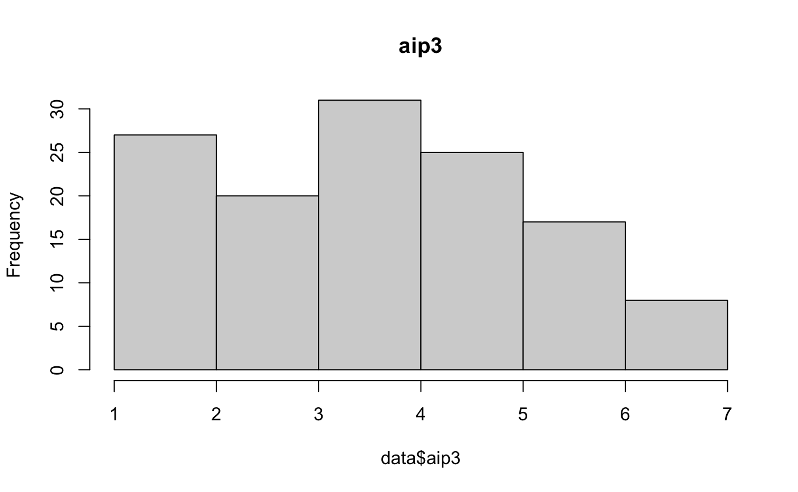

OSF: https://osf.io/cmjbk/

Results:
- [x] Parallel factor analysis
- [x] Kruskal-Wallis p-values
	- [x] demographics/individual differences to individual questions
- [x] Spearman correlation matrix
	- [x] Individual questions
	- [x] Factors
- [x] Wilcoxon test to see the difference (Confidence interval to see how big the effect could be)
- [ ] Comparison of before and after of the select what data should be allowed questions
- [ ] Chronback's alpha of the ethics questionnaire
- [x] Measure that keeps track of if students changed their answer with in-group vs out-group (RQ2/3)
	- [ ] Which direction did that flip happen
	- [ ] chi squared test
- [ ] Measure that keeps track of if students changed the amount of data that is allowed (RQ3)
- [ ] Pearson's 

### Results below:

#### Parallel Factor Analysis

![[factorLoadings.png]]

#### Correlation Matrix

|                                    |        |                       |          |            |        |        |        |        |        |        |        |        |     |     |
| ---------------------------------- | ------ | --------------------- | -------- | ---------- | ------ | ------ | ------ | ------ | ------ | ------ | ------ | ------ | --- | --- |
|                                    | gender | political_affiliation | idealism | relativism | w      | b      | a      | l      | i      | f1     | f2     | f3     |     |     |
| Gender (1 = female)                | 1.000  | -0.090                | 0.066    | -0.029     | 0.147  | -0.067 | -0.193 | 0.073  | -0.030 | -0.120 | 0.278  | -0.253 |     |     |
| Political affil (+ → conservative) | -0.090 | 1.000                 | -0.026   | 0.046      | -0.058 | 0.035  | 0.071  | 0.060  | -0.087 | 0.205  | -0.058 | 0.018  |     |     |
| idealism                           | 0.066  | -0.026                | 1.000    | 0.042      | -0.107 | 0.197  | -0.077 | 0.008  | -0.065 | 0.060  | 0.134  | -0.157 |     |     |
| relativism                         | -0.029 | 0.046                 | 0.042    | 1.000      | -0.071 | 0.040  | 0.043  | 0.129  | -0.116 | 0.010  | 0.066  | -0.125 |     |     |
| w                                  | 0.147  | -0.058                | -0.107   | -0.071     | 1.000  | -0.531 | -0.241 | -0.276 | -0.276 | 0.102  | -0.136 | 0.125  |     |     |
| b                                  | -0.067 | 0.035                 | 0.197    | 0.040      | -0.531 | 1.000  | -0.207 | -0.236 | -0.236 | -0.045 | 0.122  | -0.078 |     |     |
| a                                  | -0.193 | 0.071                 | -0.077   | 0.043      | -0.241 | -0.207 | 1.000  | -0.107 | -0.107 | 0.011  | 0.025  | 0.008  |     |     |
| l                                  | 0.073  | 0.060                 | 0.008    | 0.129      | -0.276 | -0.236 | -0.107 | 1.000  | -0.123 | -0.095 | 0.069  | -0.119 |     |     |
| i                                  | -0.030 | -0.087                | -0.065   | -0.116     | -0.276 | -0.236 | -0.107 | -0.123 | 1.000  | -0.008 | -0.061 | 0.032  |     |     |
| f1 (info for AI support)           | -0.120 | 0.205                 | 0.060    | 0.010      | 0.102  | -0.045 | 0.011  | -0.095 | -0.008 | 1.000  | -0.640 | 0.600  |     |     |
| f2 (group-specific info)           | 0.278  | -0.058                | 0.134    | 0.066      | -0.136 | 0.122  | 0.025  | 0.069  | -0.061 | -0.640 | 1.000  | -0.829 |     |     |
| f3 (increased acc justifies info)  | -0.253 | 0.018                 | -0.157   | -0.125     | 0.125  | -0.078 | 0.008  | -0.119 | 0.032  | 0.600  | -0.829 | 1.000  | **  |     |
|                                    |        |                       |          |            |        |        |        |        |        |        |        |        |     |     |

#### T Tests

f1 ~ political_affiliation: t = -2.3541, df = 42.723, p-value = 0.02323

f2 ~ gender: t = -3.3205, df = 109.49, p-value = 0.001221

f3 ~ gender: t = 2.9295, df = 114.38, p-value = 0.004099

#### Ingroup vs Outgroup changing

98 no change
30 change

wilcoxon test
V = 213, p = 0.6787

#### Question Distributions

|            | 1   | 2   | 3   | 4   | 5   | 6   | 7   |
| ---------- | --- | --- | --- | --- | --- | --- | --- |
| aip1       | 1   | 10  | 12  | 28  | 34  | 27  | 16  |
| aip2       | 2   | 12  | 13  | 19  | 35  | 29  | 18  |
| aip3       | 13  | 14  | 20  | 31  | 25  | 17  | 8   |
| aip4       | 37  | 19  | 25  | 12  | 19  | 9   | 7   |
| ai_added_1 | 48  | 80  |     |     |     |     |     |
| ai_added_2 | 22  | 106 |     |     |     |     |     |
| ai_added_3 | 95  | 33  |     |     |     |     |     |
| aip6       | 47  | 52  | 29  |     |     |     |     |
| aip7       | 46  | 51  | 31  |     |     |     |     |

aip1 = It is ethical to provide students with support that is determined by artificial intelligence algorithms.

![[aip1hist.png]]

aip2 = Indicate how much you agree with the following statement. It is ethical to use information about past academic performance for each student.

![[aip2hist.png]]

aip3 = Indicate how much you agree with the following statement. It is ethical to use information about each student's demographics.

![[aip3hist.png]]

aip4 = Imagine your school wants to improve the grades of students in math courses. Your school currently has a bias in math scores where women have historically received worse scores on math exams. To improve this, the school developed an artificial intelligence algorithm that helped by automatically scoring tests, partly based on demographic features of each student. It is ethical to include demographic information in this case.

![[aip4hist.png]]